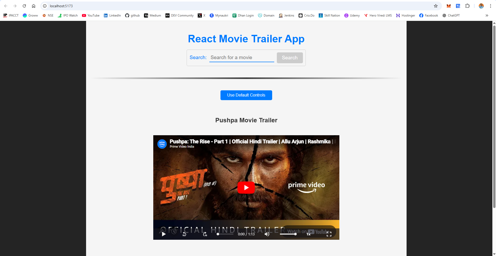
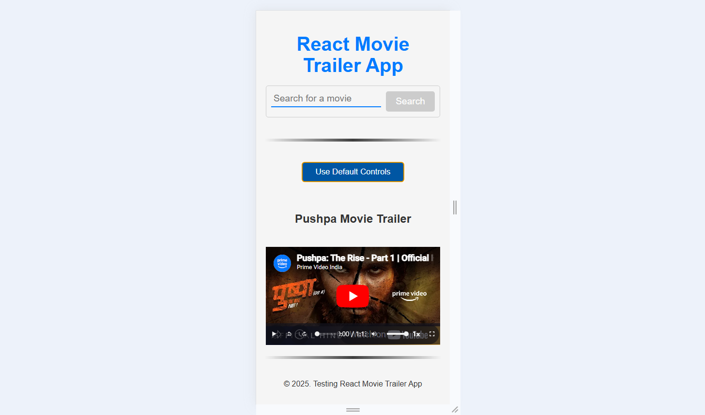

# 🎬 React Movie Trailer App

A simple and responsive React application that allows users to **search for movie trailers** and watch them using either **default player controls** or **custom controls** (powered by [media-chrome](https://github.com/media-chrome/media-chrome)).

---

## 🚀 Features

- 🔍 Movie trailer search using the `movie-trailer` package
- 🎥 Video playback with [`react-player`](https://github.com/cookpete/react-player)
- 🧩 Switch between **default** and **custom** media controls
- 🌀 Loading indicator with `react-spinners`
- 📱 Fully responsive layout and controls
- 🧼 Clean UI with modern CSS styles

---

## 🌐 Live Demo
➡️ Deployed at: https://react-movie-trailer-app.vercel.app/

This project is ready for [Vercel](https://vercel.com). Just import your repo, and you're live in seconds.

---

## 📸 Demo

  
> Screenshot App Desktop View

  
> Screenshot App Mobile View

---

## 🧰 Tech Stack

- **React** (Functional Components + Hooks)
- **react-player** – for embedding YouTube trailers
- **movie-trailer** – fetches trailer URLs based on movie titles
- **media-chrome** – custom HTML media controller UI
- **react-spinners** – loading indicator

---

## 📦 Installation

### 1. Clone the repository:
```bash
git clone https://github.com/surendergupta/react-movie-trailer-app.git
cd react-movie-trailer-app
```

### 2. Install dependencies:
```bash
npm install
```

### 3. Run the development server:
```bash
npm run dev
```
Open http://localhost:5173 to view the app in your browser.

- **Vite** – lightning-fast build tool for local development

---

## 🖥️ Usage
1. Type a movie name into the search input.
2. Click Search.
3. Watch the trailer!
4. Toggle between default and custom controls with the button.

---

## 📁 Project Structure
```css
src/
├── main.jsx
├── index.css
├── App.jsx
├── App.css
├── Components/
│   ├── SearchBox/
│   │   └── SearchBox.jsx
│   │   └── SearchBox.css
│   └── ReactPlayerBox/
│       └── ReactPlayerBox.jsx
│       └── ReactPlayerBox.css

```
---

## 🧠 Improvement Ideas
- Add recent search history
- Support for different languages or regions
- Thumbnail preview using the light prop in react-player
- Auto-suggestions using OMDB or TMDB API

---

## ✅ Todo
- Basic search and playback (Done)
- Custom media controls (Done)
- Loader while fetching (Done)
- Dark mode toggle (pending)
- Keyboard shortcuts for player (pending)

---

## 📜 License
This project is open-source and available under the MIT License.

---

## 👥 Author
Made with ❤️ by [Surender Gupta](https://linkedin.com/in/surender-gupta)
